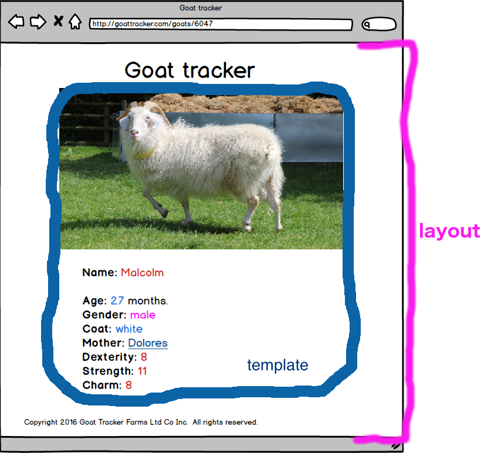

<!--
Location: SF
-->


# Angular Routing with `ngRoute`


### Why is this important?
<!-- framing the "why" in big-picture/real world examples -->
*This workshop is important because:*

Angular is built for Single Page Applications (SPAs). A SPA uses one main HTML page and dynamically updates its content, without reloading the page.

A Single Page App needs to handle user _navigation_ between "pages" in the wireframe without loading new HTML pages. In a client-side framework like Angular, routing between views is not managed by the server but by the client itself. Angular associates the path of your URL with a controller and template.

In a MEAN stack app, the Express server will handle database interactions for our own API. Angular can handle routing and requests to most external APIs.


### What are the objectives?
<!-- specific/measurable goal for students to achieve -->
*After this workshop, developers will be able to:*

- Compare and contrast client-side and server-side routing.
- Add a module to an Angular project.
- Implement client-side routing with the `ngRoute` module.
- Display views (partial template files) with the `ng-view` directive.

### Where should we be now?
<!-- call out the skills that are prerequisites -->
*Before this workshop, developers should already be able to:*

- explain how users navigate beteween different HTML pages. 
- set up HTML routes in an Express server.
- explain parameterized urls. 

### Single Page Application Example

Imagine that you're a goat herder.  You have an app to keep track of your goats (:goat::goat::goat:).  Such an app might have:

* an **index** page that displays the list of goats.    
* a **show** page that displays details about a specific goat.

Maybe it looks a little like this:


That seems alright, we can track each goat and we can click it to see more info about the goat.

### Check for Understanding

1. How would you serve the HTML for this site in Express?

  <details><summary>click for idea</summary>
    Since there are two different views with different HTML structures, the most straightforward way is to create two HTML files and two routes:
    -  a `GET /` route to send the home page's HTML file, and
    - a `GET /goats/:goatId` route to send an HTML file that could be filled in with Handlebars for each individual goat.
  </details>

  > Note: This approach results in every page having its own URL, but their are many page reloads as the user navigates the site. Since HTML files are sent over mostly complete, it's easy for search engines to crawl their content.

1. How would you build this site's front end if you were only serving *one* HTML file? (That is, how would you handle changing the appearance of the page when the user clicked on an individual goat?)

  <details><summary>click for idea</summary>
    Using jQuery, the "index" sections of the HTML page could be hidden. The single goat's information could be templated and shown on the page.

  </details>

  > Note: this approach removes page reloads, but the simplest implementation results in all pages having the same URL. Since HTML files are sent over in chunks, the time to retrieve any one view is shorter.


### With Client-side Routing

* What if your goat tracker could look like a multi-page app without page reloads?
* What if each view in your app had a unique browser URL depending on what the user was looking at?
* What if the state of the page was reflected in the URL?
* What if the user could use the back and forward buttons in the browser to smoothly navigate your site?

**Now you can!**

Notice how the urls in the wireframes above indicate where we're at?  And how some of the page content stays the same? 

**Client-side routing:**
  - ties the URL in the browser to the **state** of the current page.  If a user comes back to the same URL, they get to see the same content on the page.
  - ensures that familiar browser navigation works.
  - lets us have modular front-end **views** that are made up of **partials** inside of **layouts**.


### View Partials & Layouts

Most apps have a certain amount of content that appears on every page.  It might be:

* a menu
* a header
* a sidebar
* a footer

Using a **partial view template**, we can keep the content that *changes* in each page separate from the static content.

The content that stays the same will live in our **layout**.  In other words, maybe our *sidebar*, *footer*, and *header* all stay the same.  We keep those in the layout.  Any *content* that changes when the URL changes goes into a **partial** or **view template**.  



In our goat app above, we have a **"Goat Tracker"** title on each page.  That can be in our main layout.  Then we just apply a different partial when viewing the *index* of goats or a goat *show* page.

> Note: Some client-side routers allow you to have multiple views per layout. (`ui-router`, `Component Router`). Others do not (`ngRoute`).


### `ngRoute` background

Angular first shipped with simple routing code that let you connect one URL with one controller and one template.

Very quickly, developers in the Angular community wanted to go beyond this simple coupling and nest controllers, views, and scopes together to make more complex and modular client-side applications.

The Angular community decided to decouple the core Angular features from this early routing solution so that an alternative approach could be developed.

They extracted the initial Angular routing code into its own separate module called `ngRoute`.  

Angular's built-in `ngRoute` will most likely have all the routing features you need for your apps as you're first learning Angular. As your Angular apps become more robust, you might find yourself moving toward other solutions like the third-party `ui-router` module, which supports nested views, multiple named views, and "states".

### `ngRoute` Module

Modules group together various components. Here are `ngRoute`'s directives, provider, and services:

`ngView` (`ng-view`) directive: includes the rendered template of the current route into the main layout (index.html) file. Every time the current route changes, the included view changes with it according to the configuration of the `$route` service.

`$routeProvider` provider: used for configuring routes.

`$route` (service): used for deep-linking URLs to controllers and views (HTML partials). It watches `$location.url()` and tries to map the path to an existing route definition. The main behind-the-scenes workhorse of `ngRoute`.

`$routeParams` (service): allows you to retrieve the current set of route parameters.

### `ngRoute` Setup

#### Add `ngRoute` to your Angular app

1. Include the script tag for `ngRoute` in your `index.html`, after the Angular script tag:

  ```html
  <!-- index.html -->

  <!DOCTYPE html>
  <html ng-app="sampleApp">
  <head>

    <!-- angular -->
    <script type="text/javascript" src="https://cdnjs.cloudflare.com/ajax/libs/angular.js/1.5.3/angular.js"></script>

    <!-- angular route -->
    <script type="text/javascript" src="https://cdnjs.cloudflare.com/ajax/libs/angular.js/1.5.3/angular-route.js"></script>

    <!-- custom script (angular app) -->
    <script type="text/javascript" src="app.js"></script>

  </head>
  ...
  ```

2. Include the `ngRoute` module in your Angular app's list of dependencies:

  ```js
  // app.js

  var app = angular.module('sampleApp', ['ngRoute']);
  ```

#### Create templates for your app's "views"

You're going to turn your `index.html` file into a "layout template." Depending on the current url path, the Angular router (`ngRoute`) will include the correct partial template in the layout to be displayed to the user.  

1. Create a folder in your application called `templates`.

  ```sh
  ➜  mkdir templates
  ```

2. Create some partial template files for the different "views" in your application. We'll use the example of  templates for the homepage and the about page. Make sure to create your templates inside the `templates` folder.

  ```sh
  ➜  touch templates/home.html
  ➜  touch templates/about.html
  ```

3. In `index.html`, add a div with the `ng-view` directive inside the `<body>` tag.  The `ng-view` shows where our template HTML will go when the page is rendered.
  ```html
  <!-- index.html -->

  <body>
    <div ng-view></div>
  </body>
  ```

#### Configure your routes

1. Right after you define your Angular app in your code, use the `.config` method to set up your routes. Configure your routes using `$routeProvider` injected into `config`.

  ```js
  // app.js

  angular.module('sampleApp', ['ngRoute'])
  	.config(config);


  config.$inject = ['$routeProvider', '$locationProvider'];
  function config(   $routeProvider,   $locationProvider   ) {
    $routeProvider
      .when('/', {
        templateUrl: '/templates/home',
        controller: 'HomeController',
        controllerAs: 'homeCtrl'        
      })
      .when('/about', {
        templateUrl: '/templates/about',
        controller: 'AboutController',
        controllerAs: 'aboutCtrl'
      })
      .otherwise({
        redirectTo: '/'
      });

    $locationProvider.html5Mode({
      enabled: true,
      requireBase: false
    });
  };
  ```

#### Set up your controllers

Each route that you just set up points to its own controller, which contains its own scope. Following the homepage and about page example above, you'll need two controllers, `HomeCtrl` and `AboutCtrl`.

1. After configuring your routes, define your controllers in `app.js`:

  ```js
  // app.js

  angular.module('sampleApp', ['ngRoute'])
    .config(config)
    .controller('HomeController', HomeController)
    .controller('AboutController', AboutController);


  config.$inject = ['$routeProvider', `$locationProvider`];
  function config(   $routeProvider,   $locationProvider  ) {
    ...
  }

  HomeController.$inject = [];
  function HomeController() {
    ...
  };

  AboutController.$inject = [];
  function AboutController() {
    ...
  };
  ```

If you're having trouble getting your routes to work, the first thing to check is the spelling and file path of the `templateUrl` and the spelling of your controller (also double check that you properly defined the controller).


#### Accessing URL params

In some cases, you'll want to access URL parameters in an Angular controller. We do this by injecting the `$routeParams` provider into the controller.

Back to goats! The route `/goats/:goatId` should `show` one particular goat based on the `goatId`.

```js
angular.module('sampleApp', ['ngRoute'])
	.config(config);

config.$inject = ['$routeProvider', `$locationProvider`];
function config(   $routeProvider,   $locationProvider  ) {
  $routeProvider
    .when('/goats/:goatId', {
      templateUrl: '/templates/goats/show',
      controller: 'GoatsShowController',
      controllerAs: 'goatsShowCtrl'
    });
  $locationProvider.html5Mode({
    enabled: true,
    requireBase: false
  });
}

GoatsShowController.$inject = ['$routeParams'];
function GoatsShowController(   $routeParams   ) {
  var vm = this;

  var goatId = $routeParams.goatId;
  // use `goatId` to find specific goat
};
```

#### Link to other views

What if you want to link to another view from one of your partials?  Maybe you'd like users to be able to click a goat in the `GoatsIndexController`'s view's list of goats and be taken to that goat's show page.

1. In your HTML for each goat, you should use `ng-href`.

	```html
	<!-- templates/goats/index.html -->
	<div ng-repeat="goat in goatsIndexCtrl.goats">

		<a ng-href="/goats/{{goat.id}}">{{goat.name}}</a>

	</div>
	```

###Closing Thoughts

* How is client-side routing different from server-side routing (for HTML endpoints)?

* What is a benefit of client-side routing with `ngRoute`?  What is a benefit of server-side HTML endpoint routing with Express?


### Documentation Links

* Built-in Directives
   - [`ngRepeat`](https://docs.angularjs.org/api/ng/directive/ngRepeat)
      + [`filter`](https://docs.angularjs.org/api/ng/filter/filter)
   - [`ngHref`](https://docs.angularjs.org/api/ng/directive/ngHref)
   - [`ngStyle`](https://docs.angularjs.org/api/ng/directive/ngStyle)
* [`ngRoute` Module](https://docs.angularjs.org/api/ngRoute)
   - [`ngView` directive](https://docs.angularjs.org/api/ngRoute/directive/ngView)
   - [`$routeProvider`](https://docs.angularjs.org/api/ngRoute/provider/$routeProvider)
   - [`$routeParams`](https://docs.angularjs.org/api/ngRoute/service/$routeParams)
* [`$locationProvider`](https://docs.angularjs.org/api/ng/provider/$locationProvider)
